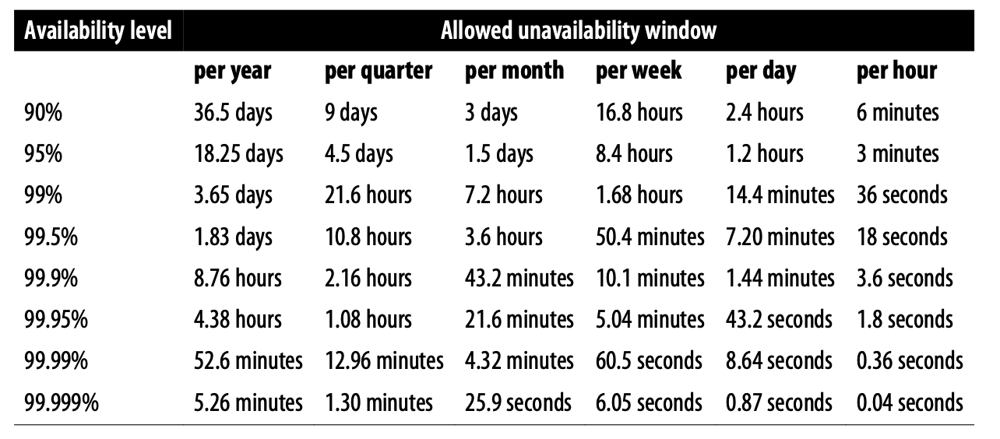

# **Availability Table**

# **可用性表格**

Availability is generally calculated based on how long a service was unavailable over some period. Assuming no planned downtime, Table A-1 indicates how much down‐ time is permitted to reach a given availability level.

可用性通常是根据某段时间内服务不可用的时间来计算的。假设没有计划停机，Table A-1指出要达到某个可用性水平允许的停机时间。

> Table A-1. Availability table

Using an aggregate unavailability metric (i.e., "X% of all operations failed”) is more useful than focusing on outage lengths for services that may be partially available— for instance, due to having multiple replicas, only some of which are unavailable— and for services whose load varies over the course of a day or week rather than remaining constant.

使用一个总体的不可用性指标（例如“所有操作中有X%失败”）比关注停机时间对于一些可能部分可用的服务更有用，例如由于有多个副本，只有一些副本不可用，并且对于负载随着一天或一周的变化而变化而不是保持不变的服务。

See Equations 3-1 and 3-2 in [Chapter 3](./../part-2/chapter-03/measuring_service_risk.md) for calculations.

请参考[第三章]((./../part-2/chapter-03/measuring_service_risk.md))的Equation 3-1和E quation 3-2进行计算。

 

---

**[Back to previous section（返回之前的章节）](./../part-2/chapter-03/measuring_service_risk.md)**
