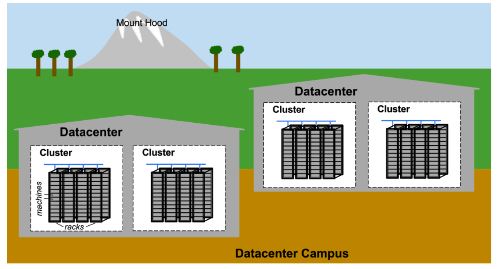

## **Hardware**

## **硬件**

Most of Google’s compute resources are in Google-designed datacenters with proprietary power distribution, cooling, networking, and compute hardware (see [[Bar13]](https://research.google/pubs/pub41606/)). Unlike “standard” colocation datacenters, the compute hardware in a Google- designed datacenter is the same across the board.1 To eliminate the confusion between server hardware and server software, we use the following terminology throughout the book:

* Machine：A piece of hardware (or perhaps a VM)
* Server：A piece of software that implements a service

谷歌的大部分计算资源都在谷歌设计的数据中心，其中包括专有的电源分配、冷却、网络和计算硬件（参见[[Bar13]](https://research.google/pubs/pub41606/)）。与“标准”托管数据中心不同，谷歌设计的数据中心中的计算硬件是统一的。为了消除对服务器硬件和服务器软件的混淆，我们在整本书中使用以下术语：

* Machine：一台硬件设备（或可能是虚拟机）
* Server：实现服务的软件组件

Machines can run any server, so we don’t dedicate specific machines to specific server programs. There’s no specific machine that runs our mail server, for example. Instead, resource allocation is handled by our cluster operating system, Borg.

Machine可以运行任何Server程序，因此我们不会将特定Machine专门用于运行特定Server程序。例如，没有专用Machine运行我们的邮件服务器。相反，资源分配由我们的集群操作系统Borg处理。

We realize this use of the word server is unusual. The common use of the word conflates “binary that accepts network connection” with machine, but differentiating between the two is important when talking about computing at Google. Once you get used to our usage of server, it becomes more apparent why it makes sense to use this specialized terminology, not just within Google but also in the rest of this book.

我们意识到“Server”这个词的使用是不寻常的。通常使用这个词时会把“接受网络连接的二进制程序”和“Server”混淆起来，但在谈论Google的计算时区分这两者非常重要。一旦你习惯了我们使用“Server”的方式，就更容易理解为什么在Google内部和本书的其他部分中使用这种专门的术语是有意义的。

Figure 2-1 illustrates the topology of a Google datacenter:

* Tens of machines are placed in a rack.
* Racks stand in a row.
* One or more rows form a cluster.
* Usually a datacenter building houses multiple clusters.
* Multiple datacenter buildings that are located close together form a campus.

Figure 2-1展示了Google数据中心的拓扑结构：

* 放置数十台Machine的机架。
* 多个机架排成一排。
* 一个集群中多排机架。
* 通常，一个数据中心大楼会容纳多个集群。
* 多个相互靠近的数据中心建筑形成一个物理区。

> Figure 2-1. Example Google datacenter campus topology

Machines within a given datacenter need to be able to talk with each other, so we created a very fast virtual switch with tens of thousands of ports. We accomplished this by connecting hundreds of Google-built switches in a Clos network fabric [[Clos53]](https://ieeexplore.ieee.org/document/6770468) named Jupiter [[Sin15]](https://research.google.com/pubs/pub43837.html). In its largest configuration, Jupiter supports 1.3 Pbps bisection bandwidth among servers.

在同一个数据中心内的机器需要相互通信，因此我们创建了一个非常快速的虚拟交换机，具有数万个端口。我们通过将数百个由Google构建的交换机连接在一起，形成了一种称为Jupiter[[Sin15]](https://research.google.com/pubs/pub43837.html)的Clos网络结构[[Clos53]](https://ieeexplore.ieee.org/document/6770468)。在最大配置下，Jupiter可以支持服务器之间的1.3Pbps的双向带宽。

Datacenters are connected to each other with our globe-spanning backbone network
B4 [[Jai13]](https://research.google.com/pubs/pub41761.html). B4 is a software-defined networking architecture (and uses the OpenFlow open-standard communications protocol). It supplies massive bandwidth to a modest number of sites, and uses elastic bandwidth allocation to maximize average bandwidth [[Kum15]](https://research.google.com/pubs/pub43838.html).

数据中心之间通过我们跨越全球的骨干网络B4相互连接[[Jai13]](https://research.google.com/pubs/pub41761.html)。B4是一种软件定义的网络架构（使用OpenFlow开放标准通信协议）。它为少量站点提供大量带宽，并使用弹性带宽分配以最大化平均带宽[[Kum15]](https://research.google.com/pubs/pub43838.html)。

 

---

**[Back to contents of the chapter（返回章节目录）](the_production_environment_at_google_from_the_viewpoint_of_an_sre.md)**

* **Next Section（下一节）：[System Software That “Organizes” the Hardware（“组织”硬件的系统软件）](system_software_that_%22organizes%22_the_hardware.md)**
