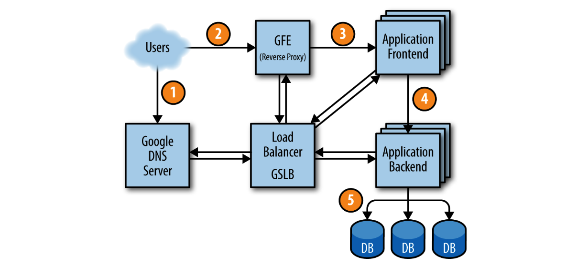

## **Shakespeare: A Sample Service**

## **Shakespeare：一个示例服务**

To provide a model of how a service would hypothetically be deployed in the Google production environment, let’s look at an example service that interacts with multiple Google technologies. Suppose we want to offer a service that lets you determine where a given word is used throughout all of Shakespeare’s works.

为了提供一个假设地在Google生产环境中部署服务的模型，让我们看一个与多个Google技术互动的示例服务。假设我们想提供一个服务，让您确定给定单词在Shakespeare的所有作品中的使用位置。

We can divide this system into two parts:

* A batch component that reads all of Shakespeare’s texts, creates an index, and writes the index into a Bigtable. This job need only run once, or perhaps very infrequently (as you never know if a new text might be discovered!).
* An application frontend that handles end-user requests. This job is always up, as users in all time zones will want to search in Shakespeare’s books.

我们可以把该系统分成两部分：

* 一个批处理组件，读取所有Shakespeare的文本，创建一个索引，并将索引写入Bigtable中。这个作业只需要运行一次，或者可能非常不频繁（因为您永远不知道是否会发现新的文本！）。
* 一个处理最终用户请求的应用程序前端。这部分工作始终运行，因为全球各个时区的用户都想在莎士比亚的书籍中进行搜索。

The batch component is a MapReduce comprising three phases.

The mapping phase reads Shakespeare’s texts and splits them into individual words. This is faster if performed in parallel by multiple workers.

The shuffle phase sorts the tuples by word.

In the reduce phase, a tuple of (word, list of locations) is created.

Each tuple is written to a row in a Bigtable, using the word as the key.

批处理组件是由三个阶段组成的MapReduce。

映射阶段读取Shakespeare的文本，并将它们分割成单独的单词。如果由多个节点并行执行，这将更快。

Shuffle阶段按单词对元组进行排序。

在Reduce阶段，创建一个由（单词，位置列表）组成的元组。

每个元组都使用单词作为键写入Bigtable的一行。

 

### **Life of a Request**

### **一个请求的生命周期**

Figure 2-4 shows how a user’s request is serviced: first, the user points their browser to shakespeare.google.com. To obtain the corresponding IP address, the user’s device resolves the address with its DNS server. This request ultimately ends up at Google’s DNS server, which talks to GSLB. As GSLB keeps track of traffic load among frontend servers across regions, it picks which server IP address to send to this user.

> Figure 2-4. The life of a request

Figure 2-4显示了如何处理用户请求：首先，用户将其浏览器指向shakespeare.google.com。为了获取相应的IP地址，用户的设备使用其DNS服务器解析地址（1）。此请求最终到达Google的DNS服务器，后者与GSLB进行通信。由于GSLB跟踪跨地区前端服务器之间的流量负载，因此它选择要向此用户发送哪个服务器IP地址。

The browser connects to the HTTP server on this IP. This server (named the Google Frontend, or GFE) is a reverse proxy that terminates the TCP connection (2). The GFE looks up which service is required (web search, maps, or—in this case—Shakespeare). Again using GSLB, the server finds an available Shakespeare frontend server, and sends that server an RPC containing the HTML request (3).

浏览器连接到此IP上的HTTP服务器。该服务器（称为Google Frontend或GFE）是一个反向代理，用于终止TCP连接（2）。 GFE查找所需的服务（Web搜索、地图或在本例中的Shakespeare）。再次使用GSLB，服务器找到一个可用的Shakespeare前端服务器，并将包含HTML请求的RPC发送给该服务器（3）。

The Shakespeare server analyzes the HTML request and constructs a protobuf containing the word to look up. The Shakespeare frontend server now needs to contact the Shakespeare backend server: the frontend server contacts GSLB to obtain the BNS address of a suitable and unloaded backend server (4). That Shakespeare backend server now contacts a Bigtable server to obtain the requested data (5).

Shakespeare服务器分析HTML请求并构造包含要查找的单词的protobuf。现在，Shakespeare前端服务器需要联系Shakespeare后端服务器：前端服务器联系GSLB获取一个适合的、未加载的后端服务器的BNS地址（4）。然后，该Shakespeare后端服务器联系Bigtable服务器以获取所请求的数据（5）。

The answer is written to the reply protobuf and returned to the Shakespeare backend server. The backend hands a protobuf containing the results to the Shakespeare frontend server, which assembles the HTML and returns the answer to the user.

答案写入回复protobuf并返回给Shakespeare后端服务器。后端将包含结果的protobuf交给Shakespeare前端服务器，后者组装HTML并将答案返回给用户。

This entire chain of events is executed in the blink of an eye—just a few hundred milliseconds! Because many moving parts are involved, there are many potential points of failure; in particular, a failing GSLB would wreak havoc. However, Google’s policies of rigorous testing and careful rollout, in addition to our proactive error recovery methods such as graceful degradation, allow us to deliver the reliable service that our users have come to expect. After all, people regularly use www.google.com to check if their Internet connection is set up correctly.

整个事件链在瞬间执行——只需几百毫秒！由于涉及许多移动部件，存在许多潜在的故障点；特别是，GSLB的故障将造成严重后果。然而，Google的严格测试和谨慎的发布政策，加上我们的主动错误恢复方法，如优雅退避，使我们能够提供用户期望的可靠服务。毕竟，人们经常使用www.google.com检查其Internet连接是否正确设置。

 

### **Job and Data Organization**

### ****

Load testing determined that our backend server can handle about 100 queries per second (QPS). Trials performed with a limited set of users lead us to expect a peak load of about 3,470 QPS, so we need at least 35 tasks. However, the following considerations mean that we need at least 37 tasks in the job, or N + 2:

* During updates, one task at a time will be unavailable, leaving 36 tasks.
* A machine failure might occur during a task update, leaving only 35 tasks, just enough to serve peak load.

负载测试确定我们的后端服务器可以处理大约每秒100个查询（QPS）。使用有限用户组进行的试验表明，我们预计最高负载为大约3,470个QPS，因此我们需要至少35个任务。然而，以下考虑因素意味着我们需要至少37个任务才能完成该作业，或者N+2:

* 在升级期间，一个任务将会是不可用的，此时剩下36个任务。
* 升级期间可能会有机器出现故障，此时剩下35个任务，恰好可以满足服务峰值负载。

A closer examination of user traffic shows our peak usage is distributed globally: 1,430 QPS from North America, 290 from South America, 1,400 from Europe and Africa, and 350 from Asia and Australia. Instead of locating all backends at one site, we distribute them across the USA, South America, Europe, and Asia. Allowing for N + 2 redundancy per region means that we end up with 17 tasks in the USA, 16 in Europe, and 6 in Asia. However, we decide to use 4 tasks (instead of 5) in South America, to lower the overhead of N + 2 to N + 1. In this case, we’re willing to tolerate a small risk of higher latency in exchange for lower hardware costs: if GSLB redirects traffic from one continent to another when our South American datacenter is over capacity, we can save 20% of the resources we’d spend on hardware. In the larger regions, we’ll spread tasks across two or three clusters for extra resiliency.

Because the backends need to contact the Bigtable holding the data, we need to also design this storage element strategically. A backend in Asia contacting a Bigtable in the USA adds a significant amount of latency, so we replicate the Bigtable in each region. Bigtable replication helps us in two ways: it provides resilience should a Bigtable server fail, and it lowers data-access latency. While Bigtable only offers eventual consistency, it isn’t a major problem because we don’t need to update the contents often.

We’ve introduced a lot of terminology here; while you don’t need to remember it all, it’s useful for framing many of the other systems we’ll refer to later.

 

---

**[Back to contents of the chapter（返回章节目录）](the_production_environment_at_google_from_the_viewpoint_of_an_sre.md)**

* **Previous Section（上一节）：[Our Development Environment（开发环境）](our_development_env.md)**
* **Next Chapter（下一章）：[Embracing Risk（拥抱风险）](./../../part-2/chapter-03/embracing_risk.md)**
