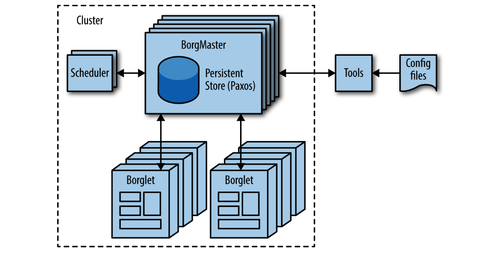
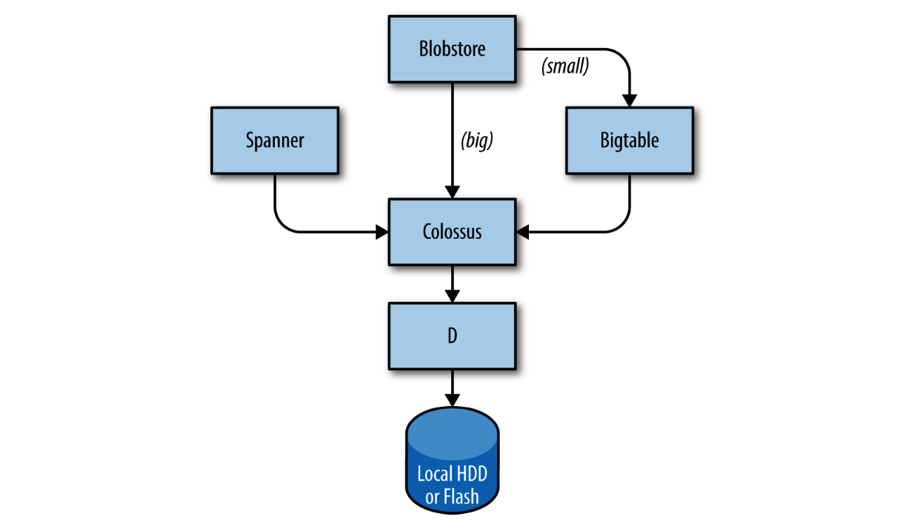

## **System Software That “Organizes” the Hardware**

## **“组织”硬件的系统软件**

Our hardware must be controlled and administered by software that can handle massive scale. Hardware failures are one notable problem that we manage with software. Given the large number of hardware components in a cluster, hardware failures occur quite frequently. In a single cluster in a typical year, thousands of machines fail and thousands of hard disks break; when multiplied by the number of clusters we operate globally, these numbers become somewhat breathtaking. Therefore, we want to abstract such problems away from users, and the teams running our services similarly don’t want to be bothered by hardware failures. Each datacenter campus has teams dedicated to maintaining the hardware and datacenter infrastructure.

我们的硬件必须由可以处理大规模的软件控制和管理。硬件故障是我们需要使用软件进行管理的一个明显问题。由于集群中硬件组件数量庞大，硬件故障相当普遍。在单个集群中，成千上万台机器会出现故障，成千上万个硬盘会损坏；当这些数字乘以我们在全球运营的集群数量时，这些数字变得令人惊人。因此，我们希望将此类问题抽象出来，运行服务的团队也不希望受到硬件故障的干扰。每个数据中心物理区都有专门维护硬件和数据中心基础设施的团队。

 

### **Managing Machines**

### **管理Machine**

Borg, illustrated in Figure 2-2, is a distributed cluster operating system [[Ver15]](https://research.google.com/pubs/pub43438.html), similar to Apache Mesos. Borg manages its jobs at the cluster level.

Borg是一个分布式的集群操作系统[[Ver15]](https://research.google.com/pubs/pub43438.html)，类似于Apache Mesos，如Figure 2-2所示。Borg在集群级别上管理其作业。

> Figure 2-2. High-level Borg cluster architecture

Borg is responsible for running users’ jobs, which can either be indefinitely running servers or batch processes like a MapReduce [[Dea04]](https://research.google.com/archive/mapreduce.html). Jobs can consist of more than one (and sometimes thousands) of identical tasks, both for reasons of reliability and because a single process can’t usually handle all cluster traffic. When Borg starts a job, it finds machines for the tasks and tells the machines to start the server program. Borg then continually monitors these tasks. If a task malfunctions, it is killed and restarted, possibly on a different machine.

Borg负责运行用户的作业，这些作业可以是无限运行的服务器，也可以是像MapReduce[[Dea04]](https://research.google.com/archive/mapreduce.html)这样的批处理进程。作业可以由一个以上（有时是数千个）相同的任务组成，这既是为了可靠性，也是因为单个进程通常无法处理所有的集群流量。当Borg启动一个作业时，它会为任务找到机器并告诉机器启动服务器程序。然后Borg不断监视这些任务。如果一个任务出现故障，它将被杀死并重新启动，可能在另一台机器上。

Because tasks are fluidly allocated over machines, we can’t simply rely on IP addresses and port numbers to refer to the tasks. We solve this problem with an extra level of indirection: when starting a job, Borg allocates a name and index number to each task using the Borg Naming Service (BNS). Rather than using the IP address and port number, other processes connect to Borg tasks via the BNS name, which is translated to an IP address and port number by BNS. For example, the BNS path might be a string such as `/bns/<cluster>/<user>/<job name>/<task number>`, which would resolve to `<IP address>:<port>`.

由于任务会流动地分配到不同的机器上，我们不能简单地依赖IP地址和端口号来引用这些任务。为了解决这个问题，我们使用了一层额外的间接级别：在启动一个作业时，Borg使用Borg命名服务（BNS）为每个任务分配了一个名称和索引号。其他进程通过BNS名称连接到Borg任务，BNS将其转换为IP地址和端口号。例如，BNS路径可能是一个字符串，例如 `/bns/<cluster>/<user>/<job name>/<task number>`，它将解析为`<IP address>:<port>`。

Borg is also responsible for the allocation of resources to jobs. Every job needs to specify its required resources (e.g., 3 CPU cores, 2 GiB of RAM). Using the list of requirements for all jobs, Borg can binpack the tasks over the machines in an optimal way that also accounts for failure domains (for example: Borg won’t run all of a job’s tasks on the same rack, as doing so means that the top of rack switch is a single point of failure for that job).

Borg还负责将资源分配给作业。每个作业都需要指定其所需的资源（例如，3个CPU核心，2GiB的RAM）。使用所有作业的需求清单，Borg可以以最优的方式将任务在机器上进行装箱，并考虑到故障域（例如：Borg不会在同一机架上运行作业的所有任务，因为这样做意味着机架顶部交换机是该作业的单点故障）。

If a task tries to use more resources than it requested, Borg kills the task and restarts it (as a slowly crashlooping task is usually preferable to a task that hasn’t been restarted at all).

如果一个任务尝试使用比它请求的资源更多的资源，Borg会杀死该任务并重新启动它（因为一个慢慢崩溃的任务通常比一个完全没有重启的任务更可取）。

 

### **Storage**

### **存储**

Tasks can use the local disk on machines as a scratch pad, but we have several cluster storage options for permanent storage (and even scratch space will eventually move to the cluster storage model). These are comparable to Lustre and the Hadoop Distributed File System (HDFS), which are both open source cluster filesystems.

任务可以使用机器上的本地磁盘作为临时存储空间，但我们有几种集群存储选项可用于永久存储（即使临时空间最终也会转移到集群存储模型）。这些选项类似于Lustre和Hadoop分布式文件系统（HDFS），它们都是开源的集群文件系统。

The storage layer is responsible for offering users easy and reliable access to the storage available for a cluster. As shown in Figure 2-3, storage has many layers:

1. The lowest layer is called D (for disk, although D uses both spinning disks and flash storage). D is a fileserver running on almost all machines in a cluster. However, users who want to access their data don’t want to have to remember which machine is storing their data, which is where the next layer comes into play.
2. A layer on top of D called Colossus creates a cluster-wide filesystem that offers usual filesystem semantics, as well as replication and encryption. Colossus is the successor to GFS, the Google File System [[Ghe03]](https://research.google.com/archive/gfs.html).
3. There are several database-like services built on top of Colossus:
   1. Bigtable [[Cha06]](https://research.google.com/archive/bigtable.html) is a NoSQL database system that can handle databases that are petabytes in size. A Bigtable is a sparse, distributed, persistent multidimensional sorted map that is indexed by row key, column key, and timestamp; each value in the map is an uninterpreted array of bytes. Bigtable supports eventually consistent, cross-datacenter replication.
   2. Spanner [[Cor12]](https://research.google.com/archive/spanner.html) offers an SQL-like interface for users that require real consistency across the world.
   3. Several other database systems, such as Blobstore, are available. Each of these options comes with its own set of trade-offs (see Chapter 26).

> Figure 2-3. Portions of the Google storage stack

存储层负责为用户提供易于使用和可靠的集群存储资源访问。如Figure 2-3所示，存储具有许多层次：

1. D的底层是磁盘（尽管D使用旋转磁盘和闪存存储）。D是在集群中几乎所有机器上运行的文件服务器。然而，希望访问其数据的用户不想记住存储其数据的机器，这就是下一层发挥作用的地方。
2. Colossus是一个位于D上层的文件系统，创建了一个集群级别的文件系统，提供了通常的文件系统语义以及复制和加密。Colossus是Google文件系统（GFS）的继任者[[Ghe03]](https://research.google.com/archive/gfs.html)。
3. 有几个基于Colossus构建的类似数据库的服务：
   1. Bigtable [[Cha06]](https://research.google.com/archive/bigtable.html) 是一种NoSQL数据库系统，可以处理大小为PB级别的数据库。Bigtable是一个稀疏的、分布式的、持久化的多维排序映射，由行键、列键和时间戳进行索引；映射中的每个值都是一个未解释的字节数组。Bigtable支持最终一致性、跨数据中心的复制。
   2. Spanner [[Cor12]](https://research.google.com/archive/spanner.html) 为需要全球真正一致性的用户提供了类似于SQL的接口。
   3. 几种其他的数据库系统也可用，如Blobstore。每个选择都有其自己的利弊权衡（请参阅第26章）。

 

### **Networking**

### **网络**

Google’s network hardware is controlled in several ways. As discussed earlier, we use an OpenFlow-based software-defined network. Instead of using “smart” routing hardware, we rely on less expensive “dumb” switching components in combination with a central (duplicated) controller that precomputes best paths across the network. Therefore, we’re able to move compute-expensive routing decisions away from the routers and use simple switching hardware.

谷歌的网络硬件是通过多种方式进行控制的。正如前面所讨论的那样，我们使用基于OpenFlow的软件定义网络。我们不使用“智能”路由硬件，而是结合中央（冗余）控制器，预先计算最佳路径来使用较便宜的“愚蠢”交换组件。因此，我们能够将计算密集型的路由决策从路由器中移出，并使用简单的交换硬件。

Network bandwidth needs to be allocated wisely. Just as Borg limits the compute resources that a task can use, the Bandwidth Enforcer (BwE) manages the available bandwidth to maximize the average available bandwidth. Optimizing bandwidth isn’t just about cost: centralized traffic engineering has been shown to solve a number of problems that are traditionally extremely difficult to solve through a combination of distributed routing and traffic engineering [[Kum15]](https://research.google.com/pubs/pub43838.html).

网络带宽需要明智地分配。与Borg限制任务可以使用的计算资源一样，带宽控制器（BwE）管理可用带宽以最大化平均可用带宽。优化带宽不仅仅是为了成本：通过分布式路由和流量工程的组合，集中化流量工程已被证明可以解决许多传统上非常难以解决的问题 [[Kum15]](https://research.google.com/pubs/pub43838.html)。

Some services have jobs running in multiple clusters, which are distributed across the world. In order to minimize latency for globally distributed services, we want to direct users to the closest datacenter with available capacity. Our Global Software Load Balancer (GSLB) performs load balancing on three levels:

* Geographic load balancing for DNS requests (for example, to www.google.com), described in Chapter 19
* Load balancing at a user service level (for example, YouTube or Google Maps)
* Load balancing at the Remote Procedure Call (RPC) level, described in Chap‐
ter 20

一些服务在多个分布在全球的集群中运行。为了最小化全球分布服务的延迟，我们希望将用户引导到具有可用容量的最近的数据中心。我们的全球软件负载均衡器 (GSLB) 在三个层面上执行负载均衡：

* 针对DNS请求的地理位置负载均衡（例如，到www.google.com的请求），在第19章中进行了描述。
* 在用户服务级别上的负载均衡（例如，YouTube或Google Maps）。
* 在远程过程调用（RPC）级别上的负载均衡，本书的第20章进行了介绍。

Service owners specify a symbolic name for a service, a list of BNS addresses of servers, and the capacity available at each of the locations (typically measured in queries per second). GSLB then directs traffic to the BNS addresses.

服务所有者会指定一个服务的符号名称、一组服务器的BNS地址和每个位置可用的容量（通常以每秒查询量衡量）。然后GSLB会将流量指向这些BNS地址。

 

---

**[Back to contents of the chapter（返回章节目录）](the_production_environment_at_google_from_the_viewpoint_of_an_sre.md)**

* **Previous Section（上一节）：[Hardware（硬件）](hardware.md)**
* **Next Section（下一节）：[Other System Software（其他系统软件）](other_system_software.md)**
