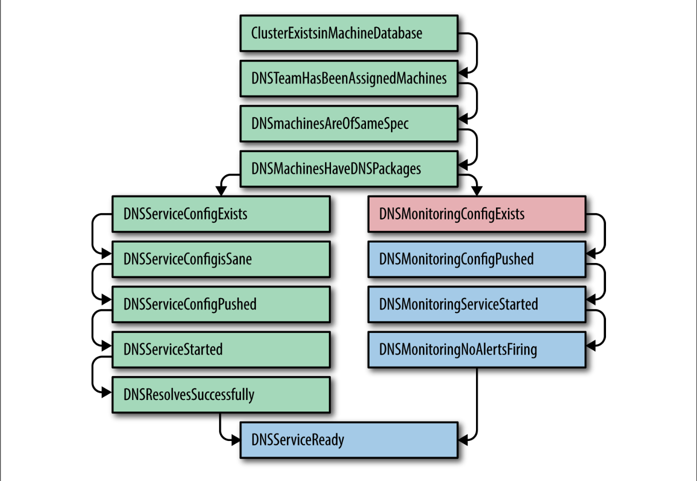
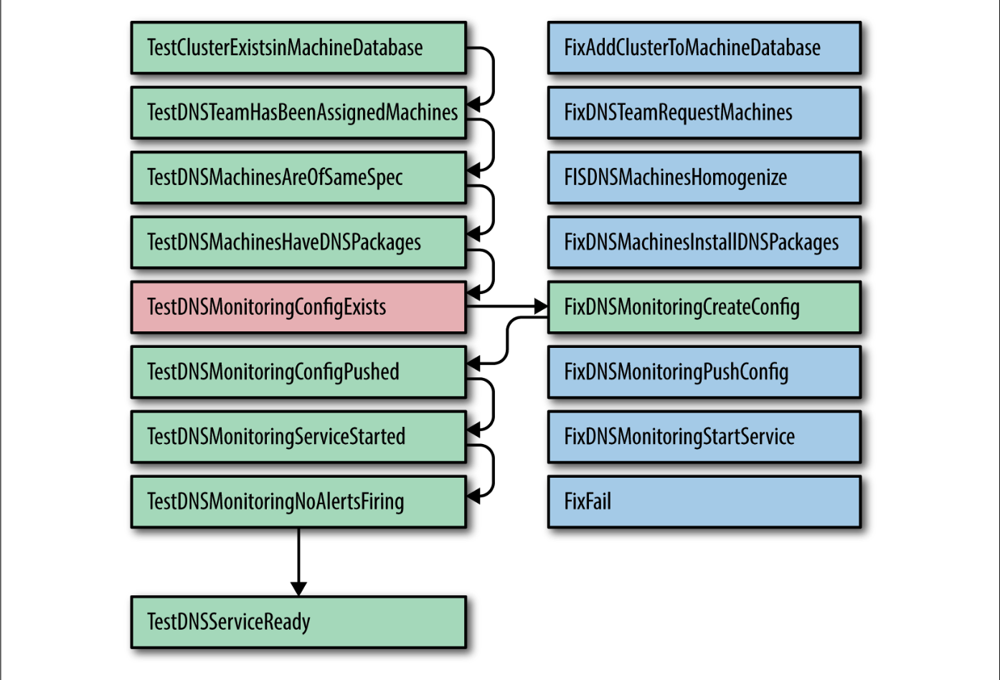

## **Soothing the Pain: Applying Automation to Cluster Turnups**

## **舒缓痛苦：将自动化应用于集群启动**

Ten years ago, the Cluster Infrastructure SRE team seemed to get a new hire every few months. As it turned out, that was approximately the same frequency at which we turned up a new cluster. Because turning up a service in a new cluster gives new hires exposure to a service’s internals, this task seemed like a natural and useful training tool.

十年前，集群基础设施SRE团队似乎每隔几个月就会有一个新员工。事实证明，这与我们启动新集群的频率大致相同。因为在一个新的集群中打开一个服务，让新员工接触到一个服务的内部，这个任务似乎是一个自然和有用的培训工具。

The steps taken to get a cluster ready for use were something like the following:

1. Fit out a datacenter building for power and cooling.
2. Install and configure core switches and connections to the backbone.
3. Install a few initial racks of servers.
4. Configure basic services such as DNS and installers, then configure a lock service, storage, and computing.
5. Deploy the remaining racks of machines.
6. Assign user-facing services resources, so their teams can set up the services.

为使一个集群准备就绪，所采取的步骤如下：

1. 装备一个数据中心大楼的电源和冷却系统。
2. 安装和配置核心交换机以及与主干网的连接。
3. 安装几个初始的服务器机架。
4. 配置基本服务，如DNS和安装程序，然后配置一个锁服务、存储和计算。
5. 部署剩余的机器机架。
6. 分配面向用户的服务资源，这样他们的团队就可以设置服务了。

Steps 4 and 6 were extremely complex. While basic services like DNS are relatively simple, the storage and compute subsystems at that time were still in heavy development, so new flags, components, and optimizations were added weekly.

第4步和第6步是非常复杂的。虽然像DNS这样的基本服务相对简单，但当时的存储和计算子系统仍在开发中，所以每周都会增加新的标志、组件和优化。

Some services had more than a hundred different component subsystems, each with a complex web of dependencies. Failing to configure one subsystem, or configuring a system or component differently than other deployments, is a customer-impacting outage waiting to happen.

一些服务有超过一百个不同的组件子系统，每个都有复杂的依赖关系。未能配置一个子系统，或者配置一个系统或组件的方式与其他部署不同，是一个等待发生的影响客户的故障。

In one case, a multi-petabyte Bigtable cluster was configured to not use the first (logging) disk on 12-disk systems, for latency reasons. A year later, some automation assumed that if a machine’s first disk wasn’t being used, that machine didn’t have any storage configured; therefore, it was safe to wipe the machine and set it up from scratch. All of the Bigtable data was wiped, instantly. Thankfully we had multiple real- time replicas of the dataset, but such surprises are unwelcome. Automation needs to be careful about relying on implicit "safety" signals.

在一个案例中，由于延迟的原因，一个多PB的Bigtable集群被配置为不使用12个磁盘系统的第一个（日志）磁盘。一年后，一些自动化人员认为，如果一台机器的第一个磁盘没有被使用，那么这台机器就没有配置任何存储；因此，擦除机器并从头开始设置是安全的。所有的Bigtable数据都被瞬间抹去了。值得庆幸的是，我们有多个数据集的实时副本，但这种意外是不受欢迎的。自动化需要谨慎对待对隐含的“安全”信号的依赖。

Early automation focused on accelerating cluster delivery. This approach tended to rely upon creative use of SSH for tedious package distribution and service initialization problems. This strategy was an initial win, but those free-form scripts became a cholesterol of technical debt.

早期的自动化着重于加速集群的交付。这种方法倾向于依靠创造性地使用SSH来解决乏味的软件包分发和服务初始化问题。这种策略最初是一种胜利，但那些自由形式的脚本成为技术债务。

 

### **Detecting Inconsistencies with Prodtest**

### **用Prodtest检测不一致的地方**

As the numbers of clusters grew, some clusters required hand-tuned flags and settings. As a result, teams wasted more and more time chasing down difficult-to-spot misconfigurations. If a flag that made GFS more responsive to log processing leaked into the default templates, cells with many files could run out of memory under load. Infuriating and time-consuming misconfigurations crept in with nearly every large configuration change.

随着集群数量的增加，一些集群需要手工调整的标志和设置。结果是，团队浪费了越来越多的时间来追寻难以发现的错误配置。几乎每一个大型的配置变化都会出现令人恼怒和耗时的错误配置。

The creative—though brittle—shell scripts we used to configure clusters were neither scaling to the number of people who wanted to make changes nor to the sheer number of cluster permutations that needed to be built. These shell scripts also failed to resolve more significant concerns before declaring that a service was good to take customer-facing traffic, such as:

* Were all of the service’s dependencies available and correctly configured?
* Were all configurations and packages consistent with other deployments?
* Could the team confirm that every configuration exception was desired?

我们用来配置集群--虽然很脆弱--的shell脚本，既不能适应想要进行修改的人数，也不能适应需要建立的集群排列组合的巨大数量。在宣布一项服务可以接受面向客户的流量之前，这些shell脚本也未能解决更重要的问题，例如：

* 所有的服务依赖都是可用的，并被正确配置了吗？
* 所有的配置和软件包是否与其他部署一致？
* 团队能否确认每个配置的例外情况都是想要的？

Prodtest (Production Test) was an ingenious solution to these unwelcome surprises. We extended the Python unit test framework to allow for unit testing of real-world services. These unit tests have dependencies, allowing a chain of tests, and a failure in one test would quickly abort. Take the test shown in Figure 7-1 as an example.

Prodtest（生产测试）是解决这些不受欢迎的意外的巧妙办法。我们扩展了Python单元测试框架，允许对真实世界的服务进行单元测试。这些单元测试有依赖性，允许一连串的测试，一个测试的失败会迅速中止。以Figure 7-1所示的测试为例。

> Figure 7-1. ProdTest for DNS Service, showing how one failed test aborts the subsequent chain of tests

A given team’s Prodtest was given the cluster name, and it could validate that team’s services in that cluster. Later additions allowed us to generate a graph of the unit tests and their states. This functionality allowed an engineer to see quickly if their service was correctly configured in all clusters, and if not, why. The graph highlighted the failed step, and the failing Python unit test output a more verbose error message.

一个特定团队的Prodtest被赋予集群名称，它可以验证该团队在该集群中的服务。后来增加的功能允许我们生成一个单元测试及其状态的图表。这个功能使工程师能够迅速看到他们的服务是否在所有集群中都配置正确，如果不是，为什么。该图突出显示了失败的步骤，失败的Python单元测试输出了一个更详细的错误信息。

Any time a team encountered a delay due to another team’s unexpected misconfiguration, a bug could be filed to extend their Prodtest. This ensured that a similar problem would be discovered earlier in the future. SREs were proud to be able to assure their customers that all services—both newly turned up services and existing services with new configuration—would reliably serve production traffic.

任何时候，如果一个团队由于另一个团队的意外错误配置而遇到延迟，就可以提交一个bug来扩展他们的Prodtest。这确保了类似的问题在未来会被更早地发现。SRE很自豪能够向他们的客户保证所有的服务--包括新开通的服务和新配置的现有服务--能够可靠地服务于生产流量。

For the first time, our project managers could predict when a cluster could "go live," and had a complete understanding of why each clusters took six or more weeks to go from "network-ready" to "serving live traffic." Out of the blue, SRE received a mission from senior management: In three months, five new clusters will reach network-ready on the same day. Please turn them up in one week.

第一次，我们的项目经理可以预测集群何时可以“上线”，并完全了解为什么每个集群从“网络就绪”到“提供实时流量”需要六周或更长时间。忽然，SRE收到了来自高级管理层的任务：三个月后，五个新的集群将在同一天达到网络就绪。请在一个星期内把它们启动起来。

 

### **Resolving Inconsistencies Idempotently**

### **轻松解决不一致的问题**

A "One Week Turnup" was a terrifying mission. We had tens of thousands of lines of shell script owned by dozens of teams. We could quickly tell how unprepared any given cluster was, but fixing it meant that the dozens of teams would have to file hundreds of bugs, and then we had to hope that these bugs would be promptly fixed.

“一周启动”是一个可怕的任务。我们有数万行的shell脚本，由几十个团队拥有。我们可以很快知道任何一个集群是多么的没有准备好，但是修复它意味着这几十个团队将不得不提交数百个bug，然后我们不得不希望这些bug会被及时修复。

We realized that evolving from "Python unit tests finding misconfigurations" to "Python code fixing misconfigurations" could enable us to fix these issues faster.

我们意识到，从“Python单元测试发现错误配置”发展到“Python代码修复错误配置”可以使我们更快地修复这些问题。

The unit test already knew which cluster we were examining and the specific test that was failing, so we paired each test with a fix. If each fix was written to be idempotent, and could assume that all dependencies were met, resolving the problem should have been easy—and safe—to resolve. Requiring idempotent fixes meant teams could run their "fix script" every 15 minutes without fearing damage to the cluster’s configuration. If the DNS team’s test was blocked on the Machine Database team’s configuration of a new cluster, as soon as the cluster appeared in the database, the DNS team’s tests and fixes would start working.

单元测试已经让我们知道正在检查的集群和正在失败的具体测试，所以我们将每个测试与一个修复配对。如果每个修复程序都被写成是空闲的，并且可以假设所有的依赖关系都被满足，那么解决问题应该是很容易和安全的。要求配对修复意味着团队可以每15分钟运行一次“修复脚本”，而不必担心对集群的配置造成损害。如果DNS团队的测试在数据库团队的新集群配置上受阻，一旦集群出现在数据库中，DNS团队的测试和修复将开始工作。

Take the test shown in Figure 7-2 as an example. If TestDnsMonitoringConfigExists fails, as shown, we can call FixDnsMonitoringCreateConfig, which scrapes configuration from a database, then checks a skeleton configuration file into our revision control system. Then TestDnsMonitoringConfigExists passes on retry, and the TestDnsMonitoringConfigPushed test can be attempted. If the test fails, the FixDnsMonitoringPushConfig step runs. If a fix fails multiple times, the automation assumes that the fix failed and stops, notifying the user.

以Figure 7-2中的测试为例。如果`TestDnsMonitoringConfigExists`失败，如图所示，我们可以调用`FixDnsMonitoringCreateConfig`，它从数据库中读取配置，然后将一个配置文件检查到我们的修订控制系统中。然后`TestDnsMonitoringConfigExists`重试通过，`TestDnsMonitoringConfigPushed`测试就可以尝试了。如果测试失败，则运行`FixDnsMonitoringPushConfig`步骤。如果修复多次失败，自动化会假定修复失败并停止，同时通知用户。

Armed with these scripts, a small group of engineers could ensure that we could go from "The network works, and machines are listed in the database" to "Serving 1% of websearch and ads traffic" in a matter of a week or two. At the time, this seemed to be the apex of automation technology.

有了这些脚本，一小群工程师可以确保我们在一两个星期内从“网络工作，机器被列入数据库”到“为1%的网络搜索和广告流量服务”。在当时，这似乎是自动化技术的顶点。

Looking back, this approach was deeply flawed; the latency between the test, the fix, and then a second test introduced flaky tests that sometimes worked and sometimes failed. Not all fixes were naturally idempotent, so a flaky test that was followed by a fix might render the system in an inconsistent state.

回过头来看，这种方法有很大的缺陷；在测试、修复和第二次测试之间的延迟带来了不稳定的测试，有时成功，有时失败。并非所有的修复都是自然而然的，所以在修复之后进行的不稳定的测试可能会使系统处于不一致的状态。

> Figure 7-2. ProdTest for DNS Service, showing that one failed test resulted in only running one fix

 

### **The Inclination to Specialize**

### **倾向于专门化**

Automation processes can vary in three respects:

* **Competence**, i.e., their accuracy
* **Latency**, how quickly all steps are executed when initiated
* **Relevance**, or proportion of real-world process covered by automation

自动化过程可以在三个方面有所不同：

* **能力**，即其准确性
* **延迟**，当启动时，所有步骤的执行速度如何
* **相关性**，即自动化所涵盖的现实世界进程的比例

We began with a process that was highly competent (maintained and run by the service owners), high-latency (the service owners performed the process in their spare time or assigned it to new engineers), and very relevant (the service owners knew when the real world changed, and could fix the automation).

我们从一个具有高度能力（由服务所有者维护和运行）、高延迟（服务所有者在业余时间执行该流程或将其分配给新的工程师）和非常相关（服务所有者知道现实世界何时发生变化，并能修复自动化）的流程开始。

To reduce turnup latency, many service owning teams instructed a single "turnup team" what automation to run. The turnup team used tickets to start each stage in the turnup so that we could track the remaining tasks, and who those tasks were assigned to. If the human interactions regarding automation modules occurred between people in the same room, cluster turnups could happen in a much shorter time. Finally, we had our competent, accurate, and timely automation process!

为了减少启动延迟，许多服务拥有团队指示一个单一的“启动团队”运行自动化。启动团队使用票据来启动每个阶段，这样我们就可以跟踪剩余的任务，以及这些任务被分配给谁。如果关于自动化模块的人际互动发生在同一个办公室，那么集群启动可以在更短的时间内发生。最后，我们有了合格、准确和及时的自动化过程！

But this state didn’t last long. The real world is chaotic: software, configuration, data, etc. changed, resulting in over a thousand separate changes a day to affected systems. The people most affected by automation bugs were no longer domain experts, so the automation became less relevant (meaning that new steps were missed) and less competent (new flags might have caused automation to fail). However, it took a while for this drop in quality to impact velocity.

但这种状态并没有持续多久。现实世界是混乱的：软件、配置、数据等都发生了变化，导致受影响的系统每天都有超过一千次的独立变化。受自动化错误影响最大的人不再是领域专家，所以自动化变得不那么相关（意味着新的步骤被遗漏）和不那么称职（新的标志可能导致自动化失败）。然而，这种质量的下降需要一段时间来影响速度。

Automation code, like unit test code, dies when the maintaining team isn’t obsessive about keeping the code in sync with the codebase it covers. The world changes around the code: the DNS team adds new configuration options, the storage team changes their package names, and the networking team needs to support new devices.

自动化代码，就像单元测试代码一样，当维护团队不执着于保持代码与它所覆盖的代码库同步时就会死亡。代码周围的世界发生了变化：DNS团队增加了新的配置选项，存储团队改变了他们的软件包名称，而网络团队需要支持新的设备。

By relieving teams who ran services of the responsibility to maintain and run their automation code, we created ugly organizational incentives:

* A team whose primary task is to speed up the current turnup has no incentive to reduce the technical debt of the service-owning team running the service in production later.
* A team not running automation has no incentive to build systems that are easy to automate.
* A product manager whose schedule is not affected by low-quality automation will always prioritize new features over simplicity and automation.

通过解除运行服务的团队维护和运行其自动化代码的责任，我们创造了丑陋的组织激励：

* 一个团队的主要任务是加快当前的启动速度，它没有动力去减少拥有服务的团队在以后生产中运行服务的技术债务。
* 一个不运行自动化的团队没有动力去建立易于自动化的系统。
* 一个产品经理的日程安排不会受到低质量自动化的影响，他总是优先考虑新功能而不是简单性和自动化。

The most functional tools are usually written by those who use them. A similar argument applies to why product development teams benefit from keeping at least some operational awareness of their systems in production.

最具功能性的工具通常是由那些使用它们的人编写的。一个类似的论点也适用于为什么产品开发团队会从对其生产中的系统至少保持一些操作意识中受益。

Turnups were again high-latency, inaccurate, and incompetent—the worst of all worlds. However, an unrelated security mandate allowed us out of this trap. Much of distributed automation relied at that time on SSH. This is clumsy from a security perspective, because people must have root on many machines to run most commands. A growing awareness of advanced, persistent security threats drove us to reduce the privileges SREs enjoyed to the absolute minimum they needed to do their jobs. We had to replace our use of sshd with an authenticated, ACL-driven, RPC-based Local Admin Daemon, also known as Admin Servers, which had permissions to perform those local changes. As a result, no one could install or modify a server without an audit trail. Changes to the Local Admin Daemon and the Package Repo were gated on code reviews, making it very difficult for someone to exceed their authority; giving someone the access to install packages would not let them view colocated logs. The Admin Server logged the RPC requestor, any parameters, and the results of all RPCs to enhance debugging and security audits.

启动是高延迟、不准确和不称职的。然而，一个无关的安全任务让我们走出了这个陷阱。当时，大部分的分布式自动化都是依靠SSH。从安全的角度看这是很笨拙的，因为人们必须在许多机器上有root权限才能运行大多数命令。对先进的、持续的安全威胁的不断认识，促使我们把SRE享有的特权减少到他们工作所需的绝对最低限度。我们不得不用一个经过认证的、ACL驱动的、基于RPC的本地管理程序（也称为管理服务器）来取代我们对sshd的使用，它有权限执行这些本地更改。因此，没有人可以在没有审计的情况下安装或修改服务器。对本地Admin Daemon和Package Repo的修改在代码审查中是有门槛的，这使得某人很难超越他们的权限；给某人安装包的权限不会让他们查看主机的日志。管理服务器记录了RPC请求者、任何参数以及所有RPC的结果，以加强调试和安全审计。

 

### **Service-Oriented Cluster-Turnup**

### **以服务为导向的集群启动**

In the next iteration, Admin Servers became part of service teams’ workflows, both as related to the machine-specific Admin Servers (for installing packages and rebooting) and cluster-level Admin Servers (for actions like draining or turning up a service). SREs moved from writing shell scripts in their home directories to building peer- reviewed RPC servers with fine-grained ACLs.

在下一个迭代中，管理服务器成为服务团队工作流程的一部分，既与特定机器的管理服务器（用于安装软件包和重启）有关，也与集群级管理服务器（用于排水或启动服务等操作）有关。SREs从在他们的主目录中编写shell脚本转向建立具有细粒度ACL的同行审查的RPC服务器。

Later on, after the realization that turnup processes had to be owned by the teams that owned the services fully sank in, we saw this as a way to approach cluster turnup as a Service-Oriented Architecture (SOA) problem: service owners would be responsible for creating an Admin Server to handle cluster turnup/turndown RPCs, sent by the system that knew when clusters were ready. In turn, each team would provide the contract (API) that the turnup automation needed, while still being free to change the underlying implementation. As a cluster reached "network-ready," automation sent an RPC to each Admin Server that played a part in turning up the cluster.

后来，在意识到启动过程必须由拥有服务的团队拥有后，我们认为这是一种将集群启动作为面向服务的架构（SOA）问题的方法：服务所有者将负责创建一个管理服务器来处理集群启动/关闭的RPC，由知道集群准备好的系统发送。反过来，每个团队将提供开启自动化所需的API，同时仍可自由改变底层实现。当一个集群达到“网络就绪”时，自动化向每个在开启集群中发挥作用的管理服务器发送RPC。

We now have a low-latency, competent, and accurate process; most importantly, this process has stayed strong as the rate of change, the number of teams, and the number of services seem to double each year.

我们现在有一个低延迟、有能力和准确的过程；最重要的是，这个过程一直保持着强劲的势头，因为变化的速度、团队的数量和服务的数量似乎每年都在翻倍。

As mentioned earlier, our evolution of turnup automation followed a path:

1. Operator-triggered manual action (no automation)
2. Operator-written, system-specific automation
3. Externally maintained generic automation
4. Internally maintained, system-specific automation
5. Autonomous systems that need no human intervention

综上所述，我们的启动自动化的演变遵循了一条路径：

1. 操作员触发的人工行动（没有自动化）
2. 操作员编写的、针对系统的自动化
3. 外部维护的通用自动化
4. 内部维护的、系统特定的自动化
5. 不需要人类干预的自主系统

While this evolution has, broadly speaking, been a success, the Borg case study illustrates another way we have come to think of the problem of automation.

虽然从广义上讲，这种演变是成功的，但Borg案例研究说明了我们对自动化问题的另一种思考方式。

 

---

**[Back to contents of the chapter（返回章节目录）](the_evolution_of_automation_at_google.md)**

* **Previous Section（上一节）：[Automate Yourself Out of a Job: Automate ALL the Things!（让自己的工作自动化：把所有的事情都自动化!）](automate_yourself_out_of_a_job.md)**
* **Next Section（下一节）：[Borg: Birth of the Warehouse-Scale Computer（Borg：仓库级计算机的诞生）](borg.md)**
