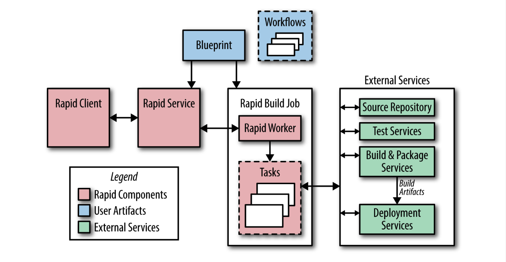

## **Continuous Build and Deployment**

Google has developed an automated release system called Rapid. Rapid is a system that leverages a number of Google technologies to provide a framework that delivers scalable, hermetic, and reliable releases. The following sections describe the software lifecycle at Google and how it is managed using Rapid and other associated tools.

 

### **Building**

Blaze is Google’s build tool of choice. It supports building binaries from a range of languages, including our standard languages of C++, Java, Python, Go, and JavaScript. Engineers use Blaze to define build targets (e.g., the output of a build, such as a JAR file), and to specify the dependencies for each target. When performing a build, Blaze automatically builds the dependency targets.

Build targets for binaries and unit tests are defined in Rapid’s project configuration files. Project-specific flags, such as a unique build identifier, are passed by Rapid to Blaze. All binaries support a flag that displays the build date, the revision number, and the build identifier, which allow us to easily associate a binary to a record of how it was built.

 

### **Branching**

All code is checked into the main branch of the source code tree (mainline). However, most major projects don’t release directly from the mainline. Instead, we branch from the mainline at a specific revision and never merge changes from the branch back into the mainline. Bug fixes are submitted to the mainline and then cherry picked into the branch for inclusion in the release. This practice avoids inadvertently picking up unrelated changes submitted to the mainline since the original build occurred. Using this branch and cherry pick method, we know the exact contents of each release.

 

### **Testing**

A continuous test system runs unit tests against the code in the mainline each time a change is submitted, allowing us to detect build and test failures quickly. Release engineering recommends that the continuous build test targets correspond to the same test targets that gate the project release. We also recommend creating releases at the revision number (version) of the last continuous test build that successfully completed all tests. These measures decrease the chance that subsequent changes made to the mainline will cause failures during the build performed at release time.

During the release process, we re-run the unit tests using the release branch and create an audit trail showing that all the tests passed. This step is important because if a release involves cherry picks, the release branch may contain a version of the code that doesn’t exist anywhere on the mainline. We want to guarantee that the tests pass in the context of what’s actually being released.

To complement the continuous test system, we use an independent testing environment that runs system-level tests on packaged build artifacts. These tests can be launched manually or from Rapid.

 

### **Packaging**

Software is distributed to our production machines via the Midas Package Manager (MPM) [McN14c]. MPM assembles packages based on Blaze rules that list the build artifacts to include, along with their owners and permissions. Packages are named (e.g., search/shakespeare/frontend), versioned with a unique hash, and signed to ensure authenticity. MPM supports applying labels to a particular version of a package. Rapid applies a label containing the build ID, which guarantees that a package can be uniquely referenced using the name of the package and this label.

Labels can be applied to an MPM package to indicate a package’s location in the release process (e.g., dev, canary, or production). If you apply an existing label to a new package, the label is automatically moved from the old package to the new package. For example: if a package is labeled as canary, someone subsequently installing the canary version of that package will automatically receive the newest version of the package with the label canary.

 

### **Rapid**

Figure 8-1 shows the main components of the Rapid system. Rapid is configured with files called blueprints. Blueprints are written in an internal configuration language and are used to define build and test targets, rules for deployment, and administrative information (like project owners). Role-based access control lists determine who can perform specific actions on a Rapid project.

> Figure 8-1. Simplified view of Rapid architecture showing the main components of the system

Each Rapid project has workflows that define the actions to perform during the release process. Workflow actions can be performed serially or in parallel, and a workflow can launch other workflows. Rapid dispatches work requests to tasks running as a Borg job on our production servers. Because Rapid uses our production infrastructure, it can handle thousands of release requests simultaneously.

A typical release process proceeds as follows:

1. Rapid uses the requested integration revision number (often obtained automatically from our continuous test system) to create a release branch.
2. Rapid uses Blaze to compile all the binaries and execute the unit tests, often performing these two steps in parallel. Compilation and testing occur in environments dedicated to those specific tasks, as opposed to taking place in the Borg job where the Rapid workflow is executing. This separation allows us to parallelize work easily.
3. Build artifacts are then available for system testing and canary deployments. A typical canary deployment involves starting a few jobs in our production environment after the completion of system tests.
4. The results of each step of the process are logged. A report of all changes since the last release is created.

Rapid allows us to manage our release branches and cherry picks; individual cherry pick requests can be approved or rejected for inclusion in a release.

 

### **Deployment**

Rapid is often used to drive simple deployments directly. It updates the Borg jobs to use newly built MPM packages based on deployment definitions in the blueprint files and specialized task executors.

For more complicated deployments, we use Sisyphus, which is a general-purpose rollout automation framework developed by SRE. A rollout is a logical unit of work that is composed of one or more individual tasks. Sisyphus provides a set of Python classes that can be extended to support any deployment process. It has a dashboard that allows for finer control on how the rollout is performed and provides a way to monitor the rollout’s progress.

In a typical integration, Rapid creates a rollout in a long-running Sisyphus job. Rapid knows the build label associated with the MPM package it created, and can specify that build label when creating the rollout in Sisyphus. Sisyphus uses the build label to specify which version of the MPM packages should be deployed.

With Sisyphus, the rollout process can be as simple or complicated as necessary. For example, it can update all the associated jobs immediately or it can roll out a new binary to successive clusters over a period of several hours.

Our goal is to fit the deployment process to the risk profile of a given service. In development or pre-production environments, we may build hourly and push releases automatically when all tests pass. For large user-facing services, we may push by starting in one cluster and expand exponentially until all clusters are updated. For sensitive pieces of infrastructure, we may extend the rollout over several days, interleaving them across instances in different geographic regions.
