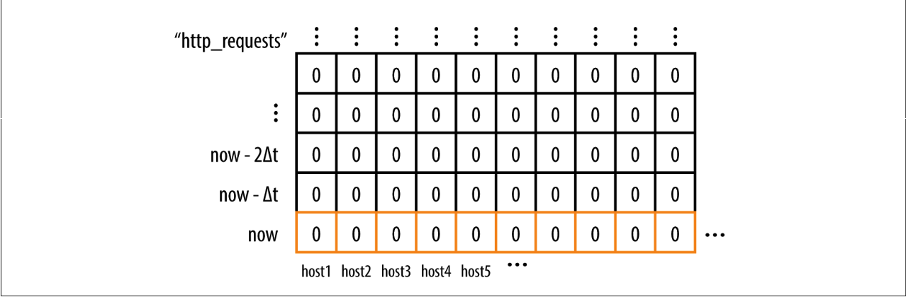
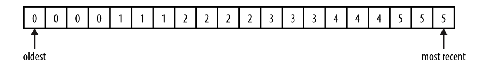

## **Storage in the Time-Series Arena**

A service is typically made up of many binaries running as many tasks, on many machines, in many clusters. Borgmon needs to keep all that data organized, while allowing flexible querying and slicing of that data.

Borgmon stores all the data in an in-memory database, regularly checkpointed to disk. The data points have the form (timestamp, value), and are stored in chronological lists called time-series, and each time-series is named by a unique set of labels, of the form name=value.

As presented in Figure 10-1, a time-series is conceptually a one-dimensional matrix of numbers, progressing through time. As you add permutations of labels to this time-series, the matrix becomes multidimensional.

> Figure 10-1. A time-series for errors labeled by the original host each was collected from

In practice, the structure is a fixed-sized block of memory, known as the time-series arena, with a garbage collector that expires the oldest entries once the arena is full. The time interval between the most recent and oldest entries in the arena is the horizon, which indicates how much queryable data is kept in RAM. Typically, datacenter and global Borgmon are sized to hold about 12 hours of data9 for rendering consoles, and much less time if they are the lowest-level collector shards. The memory requirement for a single data point is about 24 bytes, so we can fit 1 million unique time-series for 12 hours at 1-minute intervals in under 17 GB of RAM.

Periodically, the in-memory state is archived to an external system known as the Time-Series Database (TSDB). Borgmon can query TSDB for older data and, while slower, TSDB is cheaper and larger than a Borgmon’s RAM.

 

### **Labels and Vectors**

As shown in the example time-series in Figure 10-2, time-series are stored as sequences of numbers and timestamps, which are referred to as vectors. Like vectors in linear algebra, these vectors are slices and cross-sections of the multidimensional matrix of data points in the arena. Conceptually the timestamps can be ignored, because the values are inserted in the vector at regular intervals in time—for example, 1 or 10 seconds or 1 minute apart.

> Figure 10-2. An example time-series

The name of a time-series is a labelset, because it’s implemented as a set of labels expressed as key=value pairs. One of these labels is the variable name itself, the key that appears on the varz page.

A few label names are declared as important. For the time-series in the time-series database to be identifiable, it must at minimum have the following labels:

* **`var`**: The name of the variable
* **`job`**: The name given to the type of server being monitored
* **`service`**: A loosely defined collection of jobs that provide a service to users, either internal or external
* **`zone`**: A Google convention that refers to the location (typically the datacenter) of the Borgmon that performed the collection of this variable

Together, these variables appear something like the following, called the variable expression:

`{var=http_requests,job=webserver,instance=host0:80,service=web,zone=us-west}`

A query for a time-series does not require specification of all these labels, and a search for a labelset returns all matching time-series in a vector. So we could return a vector of results by removing the instance label in the preceding query, if there were more than one instance in the cluster. For example:

`{var=http_requests,job=webserver,service=web,zone=us-west}`

might have a result of five rows in a vector, with the most recent value in the time- series like so:

`{var=http_requests,job=webserver,instance=host0:80,service=web,zone=us-west} 10`

`{var=http_requests,job=webserver,instance=host1:80,service=web,zone=us-west} 9`

`{var=http_requests,job=webserver,instance=host2:80,service=web,zone=us-west} 11`

`{var=http_requests,job=webserver,instance=host3:80,service=web,zone=us-west} 0`

`{var=http_requests,job=webserver,instance=host4:80,service=web,zone=us-west} 10`

Labels can be added to a time-series from:

* The target’s name, e.g., the job and instance
* The target itself, e.g., via map-valued variables
* The Borgmon configuration, e.g., annotations about location or relabeling
* The Borgmon rules being evaluated

We can also query time-series in time, by specifying a duration to the variable expression:

`{var=http_requests,job=webserver,service=web,zone=us-west}[10m]`

This returns the last 10 minutes of history of the time-series that matched the expression. If we were collecting data points once per minute, we would expect to return 10 data points in a 10-minute window, like so:

`{var=http_requests,job=webserver,instance=host0:80, ...} 0 1 2 3 4 5 6 7 8 9 10`

`{var=http_requests,job=webserver,instance=host1:80, ...} 0 1 2 3 4 4 5 6 7 8 9`

`{var=http_requests,job=webserver,instance=host2:80, ...} 0 1 2 3 5 6 7 8 9 9 11`

`{var=http_requests,job=webserver,instance=host3:80, ...} 0 0 0 0 0 0 0 0 0 0 0`

`{var=http_requests,job=webserver,instance=host4:80, ...} 0 1 2 3 4 5 6 7 8 9 10`
